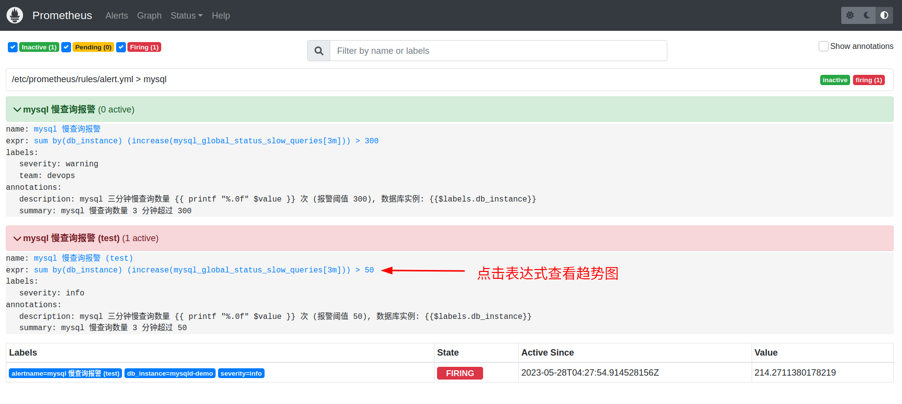
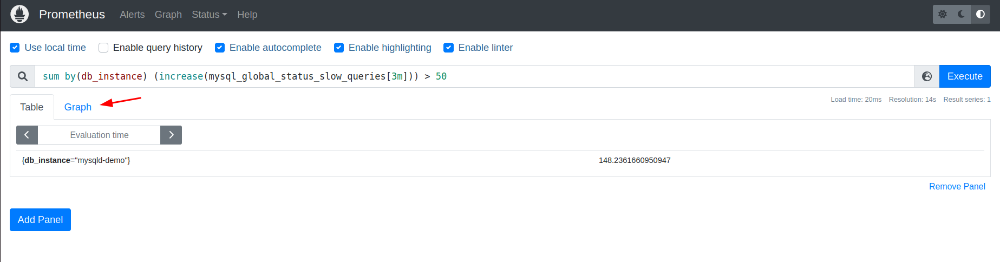
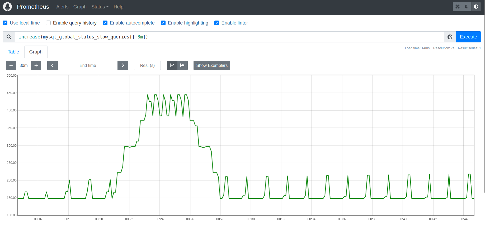
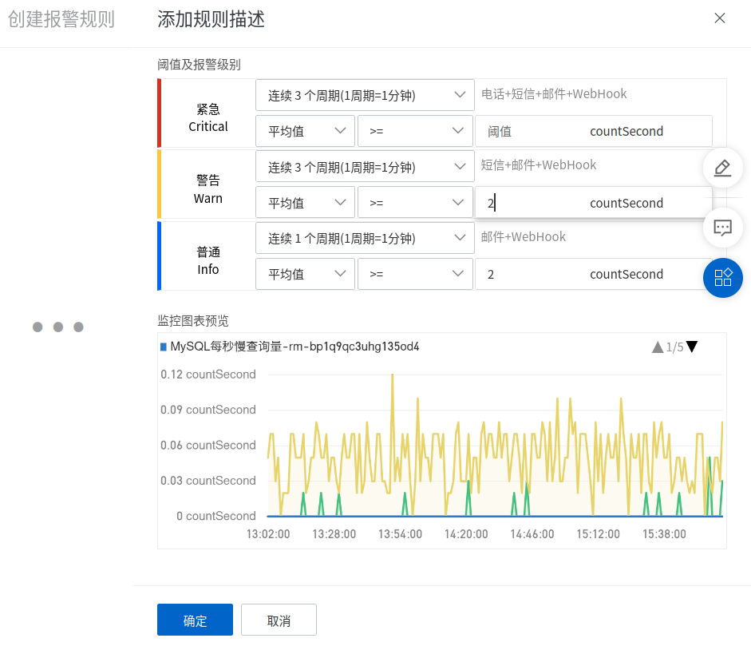

# prometheus 监控 mysql 慢查询

我们用 [docker-compose](https://docs.docker.com/compose/) 部署一套单机版 prometheus 集群，`docker-compose up -d` 启动后可以直接看到监控效果。

## 部署思路

首先我们用 `docker-compose` 启动 3 个容器，`prometheus` `mysqld-exporter` 和 `mysql:8.0` 容器。

``` yaml
version: "3"

services:
  prometheus:
    image: prom/prometheus:v2.37.8

  ## mysqldexporter: mysql 服务器指标输出
  mysqldexporter:
    image: prom/mysqld-exporter:v0.14.0

  ## mysqld: 模拟一台 mysql 数据库服务器
  mysqld:
    image: mysql:8.0
```

### 模拟 mysql 慢查询

写一个脚本模拟 mysql 慢查询：

``` shell
for i in {1..65535}; do
  mysql -e "select sleep(0.5)"
done
```

> 完整脚本请参考 [slowquery.sh](https://github.com/sir5kong/prometheus-examples/blob/main/mysqld-exporter/slowquery.sh)

> 为了快速看到监控数据，我们已经把 mysql 的慢查询阈值调到 0.1 秒，上一步启动的 mysqld 加入了启动参数 `--long_query_time=0.1`。`long_query_time` 默认是 10 秒，建议调低，生产环境中调到 0.1 秒也是可以的。

向 `docker-compose.yml` 添加一段：

``` yaml
# services:

  ## slowquery 模拟慢查询，生成监控数据
  slowquery:
    image: mysql:8.0
    volumes:
      - ./slowquery.sh:/slowquery.sh
    command:
      - "/bin/bash"
      - "-c"
      - "/slowquery.sh"
```

### 添加 alertmanager

这一步添加 2 个容器，`alertmanager` 和 `alert-relay` 用于发送报警消息到飞书，`alert-relay` 可以把 promethus 报警消息转换为办公软件对应的消息格式。

``` yaml
# services:

  ## alertmanager 报警管理器
  alertmanager:
    image: prom/alertmanager:v0.25.0

  ## alert-relay 用于转发报警消息，兼容飞书、钉钉、微信，可以自定义 WebHook 消息格式
  alert-relay:
    image: feiyu563/prometheus-alert:v4.8.2
```

## prometheus 配置

``` yaml
global:
  scrape_interval: 30s

## rule_files 从匹配的文件中读取报警规则
rule_files:
  - /etc/prometheus/rules/*

alerting:
  alertmanagers:
    - static_configs:
      - targets: ['alertmanager:9093']

scrape_configs:
  - job_name: 'mysql'
    ## scrape_interval 采集指标的间隔
    ## 为了快速看出监控效果，这里调到 10s
    scrape_interval: 10s
    static_configs:
      - targets: ['mysqldexporter:9104']
        ## labels 自定义标签
        labels:
          db_instance: mysqld-demo
```

报警规则：

``` yaml
## /etc/prometheus/rules/alert.yml
groups:
- name: mysql
  rules:
  - alert: "mysql 慢查询报警 (test)"
    expr: sum by (db_instance) (increase(mysql_global_status_slow_queries{}[3m])) > 50
    for: 1m
    labels:
      severity: info
    annotations:
      summary: 'mysql 慢查询数量 3 分钟超过 50'
      description: 'mysql 三分钟慢查询数量 {{ printf "%.0f" $value }} 次 (报警阈值 50), 数据库实例: {{$labels.db_instance}}'
```

## 完整 docker-compose 配置

``` yaml
version: "3"

volumes:
  prometheus_data: {}
  mysqld_data: {}
  # grafana_data: {}

services:
  prometheus:
    image: prom/prometheus:v2.37.8
    #environment:
    #  - TZ=UTC-8
    volumes:
      - ./prom-conf:/etc/prometheus:ro
      - prometheus_data:/prometheus
    command:
      - '--web.enable-lifecycle'
      - '--config.file=/etc/prometheus/prometheus.yml'
    ports:
      - '19090:9090'

  ## mysqldexporter: mysql 服务器指标输出
  ## https://github.com/prometheus/mysqld_exporter
  mysqldexporter:
    image: prom/mysqld-exporter:v0.14.0
    environment:
      - DATA_SOURCE_NAME=root:Foo123456@(mysqld:3306)/
    depends_on:
      - mysqld
    #ports:
    #  - 9104:9104

  ## mysqld: 模拟一台 mysql 数据库服务器
  mysqld:
    image: mysql:8.0
    volumes:
      - mysqld_data:/var/lib/mysql
    environment:
      - MYSQL_ROOT_PASSWORD=Foo123456
      - MYSQL_DATABASE=sir5kong
    #ports:
    #  - 3306:3306
    command:
      - "mysqld"
      - "--innodb_buffer_pool_size=32M"
      - "--innodb_buffer_pool_instances=1"
      - "--slow_query_log=1"
      - "--long_query_time=0.1"

  ## slowquery 模拟慢查询，生成监控数据
  slowquery:
    image: mysql:8.0
    volumes:
      - ./slowquery.sh:/slowquery.sh
    command:
      - "/bin/bash"
      - "-c"
      - "/slowquery.sh"
    environment:
      - MYSQL_USER=root
      - MYSQL_PASSWORD=Foo123456
      - MYSQL_HOST=mysqld
      - MYSQL_DATABASE=sir5kong
    depends_on:
      - mysqld
      - mysqldexporter
    stop_grace_period: 1s

  ## alertmanager 报警管理器
  alertmanager:
    image: prom/alertmanager:v0.25.0
    volumes:
      - ./alertmanager.yml:/config/alertmanager.yml
    command:
      - '--config.file=/config/alertmanager.yml'
    #ports:
    #  - '9093:9093'

  ## alert-relay 用于转发报警消息，兼容飞书、钉钉、微信，可以自定义 WebHook 消息格式
  alert-relay:
    image: feiyu563/prometheus-alert:v4.8.2
    ports:
      - "38080:8080"
    environment:
      - PA_LOGIN_USER=admin
      - PA_LOGIN_PASSWORD=Foo123456
      - PA_OPEN_FEISHU=1
      - PA_OPEN_DINGDING=1
      - PA_OPEN_WEIXIN=1

```

## 启动

``` yaml
docker-compose up -d
```

## 查看监控数据

浏览器访问: <http://127.0.0.1:19090/alerts>

> 如果不是本机部署，需要把上面的 ip 换成目标机器的地址。







> 把末尾的条件 `> 50` 去掉，可以看到完整的数据

``` sql
max by(db_instance) (increase(mysql_global_status_slow_queries[3m]))
```

## prometheus 查询语法

上面的报警规则 `sum by (db_instance) (increase(mysql_global_status_slow_queries{}[3m])) > 50`, 我们用到了 `mysql_global_status_slow_queries` 这个「计数器指标」，当前值是 mysql 服务器运行到现在所有慢查询总数。

想要清晰地展现慢查询趋势和高低峰时间段，一般会用到 `rate` `irate` `increase` 等函数。

``` sql
rate(mysql_global_status_slow_queries[1m])
irate(mysql_global_status_slow_queries[3m])
increase(mysql_global_status_slow_queries[3m])
```

按实例进行聚合:

``` sql
sum by(db_instance) (rate(mysql_global_status_slow_queries[1m]))
sum by(db_instance) (irate(mysql_global_status_slow_queries[3m]))
sum by(db_instance) (increase(mysql_global_status_slow_queries[3m]))
max by(db_instance) (increase(mysql_global_status_slow_queries[3m]))
```

### Counter 「计数器指标」

`mysql_global_status_slow_queries` 是一个 `Counter` 类型的指标，即「计数器指标」，该指标一般以 `total` 结尾，有少数例外。

`Counter` 适合只增不减的指标，例如 「 HTTP 请求量」、「 CPU 使用量」。

```
http_requests_total
node_cpu_seconds_total
container_cpu_usage_seconds_total
```

可能有人觉得「 CPU 使用量」会上下浮动，实际上这是错觉，进程的「 CPU 使用量」是持续增加的，会上下浮动的是「某一时刻的 CPU 使用量」。

「 Counter 指标」会在进程重启后重置，使用 `rate` `increase` 等函数会消除重启导致的影响。

### Counter 优势

以 `http_requests_total` 为例：

- 第 1 秒请求量: 100, `http_requests_total`: 100
- ~~第 2 秒请求量: 150, `http_requests_total`: 250~~
- 第 3 秒请求量: 50, `http_requests_total`: 300

上面这个案例，平均每秒请求量是 100，假如第 2 秒数据采集失败，计算平均数，`(100 + 50) / 2 = 75`，而 http_requests_total 统计的结果是 3 秒总请求量 300 次，平均每秒还是 100，丢失的只是第二秒和第三秒请求量的波动。

> 这里只是举个例子，实际上监控的采集频率不会是每秒一次。

## 对比传统监控



上面是阿某云（云监控）默认的报警规则，我遇到的问题是报警要么很频繁，要么很难报出来。

针对这个问题我提工单咨询过，`2 countSecond` 可以看作一分钟 120 次，连续 3 个周期相当于一分钟 120 次并持续 3 分钟。

如果设置为持续 3 个周期，那报警就不敏感，例如第一分钟 200 次，第二分钟 80 次，如此循环，那报警就永远不会触发。如果设置为持续 1 个周期，那报警就会过于敏感。

使用 Pormetheus 方案，我可以计算任意时间段慢查询总量：

```
increase(mysql_global_status_slow_queries[1m]) > 120
increase(mysql_global_status_slow_queries[3m]) > 360
increase(mysql_global_status_slow_queries[10m]) > 800
```

自建监控，这个问题就完美解决了。